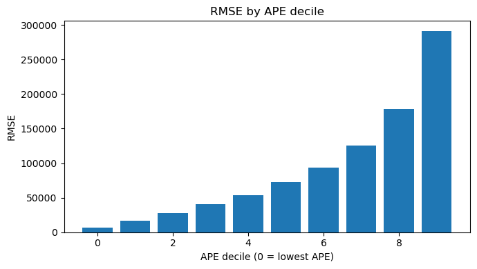
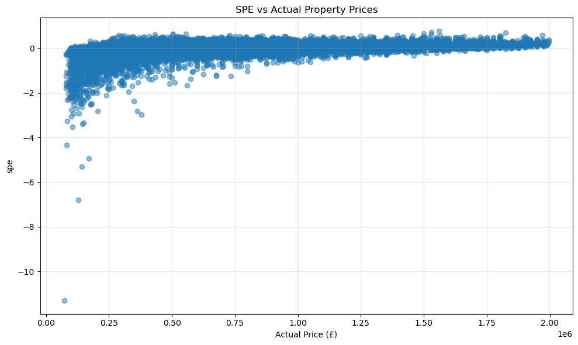
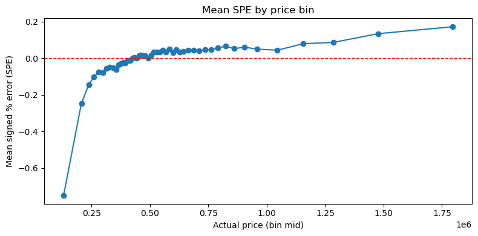
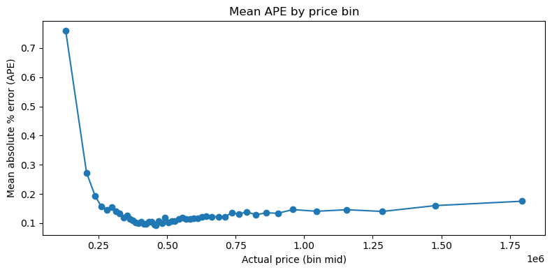

```python
# Import modules

import pandas as pd
import lightgbm as lgb
import optuna
import time
from sklearn.model_selection import cross_val_score
from sklearn.metrics import mean_squared_error, mean_absolute_error, r2_score
import matplotlib.pyplot as plt
import numpy as np
import plotly.express as px

```


```python

master_path = '../../Master_v2.xlsx'
all_data = pd.read_excel(master_path)

print(all_data.head())
```

         price     priceper  year dateoftransfer         borough  postcode  \
    0   490000  10208.33333  2022     2022-01-21  city of london  EC4A 1EP   
    1   802500  10422.07792  2015     2015-10-16  city of london  EC1Y 0ST   
    2  1200000  15189.87342  2019     2019-08-16  city of london  EC2Y 5AG   
    3   626250  12780.61224  2015     2015-03-03  city of london  EC2Y 5AG   
    4   938400  14436.92308  2015     2015-01-29  city of london  EC2Y 5AG   
    
                                transactionid  tfarea area_bin propertytype  ...  \
    0  {DE2D0CDF-F797-51EE-E053-6C04A8C00671}    48.0       Q1            F  ...   
    1  {23B6165E-9D97-FCF4-E050-A8C0620577FA}    77.0       Q2            F  ...   
    2  {93E6821D-E5C2-40FD-E053-6B04A8C0C1DF}    79.0       Q3            F  ...   
    3  {637497CC-ECF1-4AFD-B581-E63781F99F4B}    49.0       Q1            F  ...   
    4  {74550953-773F-4D4F-A43E-1E79826CD95B}    65.0       Q2            F  ...   
    
        central       ptal  crime_lagged_1yr  cpih_lagged_1yr  \
    0  0.190356  65.991818              0.13              0.9   
    1  2.970801  53.411383              0.09              1.1   
    2  2.674194  85.324898              0.11              2.3   
    3  2.674194  85.324898              0.09              1.6   
    4  2.674194  85.324898              0.09              1.6   
    
       unemployment_lagged_1yr  mortgage_lagged_1yr  avg_price_lagged_1yr  \
    0                     4.83                1.816              527500.0   
    1                     6.36                2.955                   NaN   
    2                     4.12                1.973             1158666.6   
    3                     6.36                2.955                   NaN   
    4                     6.36                2.955                   NaN   
    
       avg_priceper_lagged_1yr        lat      long  
    0             13187.500000  51.516682 -0.109302  
    1                      NaN  51.523002 -0.096989  
    2             13279.846418  51.518359 -0.092944  
    3                      NaN  51.518359 -0.092944  
    4                      NaN  51.518359 -0.092944  
    
    [5 rows x 24 columns]


```python
#Handle missing values
initial_rows = len(all_data.index)
all_data = all_data.dropna()
print(f"Number of rows removed for NA: {initial_rows - len(all_data.index)}")

```

    Number of rows removed for NA: 247500


```python
#Remove outliers >2.0million
all_data = all_data.drop(all_data[all_data['price'] >= 2000000].index)
# all_data = all_data.drop(all_data[all_data['price'] <= 210000].index)

print(f"Total number of rows for train/test/validation: {len(all_data.index)}")
```

    Total number of rows for train/test/validation: 581471


```python
# Shuffle rows within years
all_data = all_data.groupby('year').apply(lambda x: x.sample(frac=1, random_state=42)).reset_index(drop=True)
```

    /var/folders/_6/n4f9pfd14lv1q8nl3892x2v80000gn/T/ipykernel_16659/709444405.py:2: DeprecationWarning:
    
    DataFrameGroupBy.apply operated on the grouping columns. This behavior is deprecated, and in a future version of pandas the grouping columns will be excluded from the operation. Either pass `include_groups=False` to exclude the groupings or explicitly select the grouping columns after groupby to silence this warning.
    


```python
#Define features and target: Uses price as as target and area as predictor
# Create outward postcode (e.g., "SW1A") for location signal
all_data['outward_postcode'] = all_data['postcode'].str.split().str[0]

target = 'price'
features = ['tfarea', 'propertytype', 'duration', 'education', 'culture', 'central', 'ptal', 'crime_lagged_1yr', 'cpih_lagged_1yr', 'unemployment_lagged_1yr', 'mortgage_lagged_1yr', 'avg_price_lagged_1yr', 'borough', 'postcode', 'lat', 'long']
categorical_features = ['propertytype', 'duration', 'borough', 'postcode']

#Split into train/test based on time
test_data = all_data[all_data['year'] == 2024]
train_full = all_data.drop(all_data[all_data['year'] == 2024].index)
print(f"Length of test data {len(test_data)}")
print(f"Length of training data {len(train_full)}")

# Test split
X_test = test_data[features].copy()
# Convert categorical columns to category dtype (LightGBM requires category, not object/string)
for col in categorical_features:
    X_test[col] = X_test[col].astype('category')
Y_test = test_data[target]

# Train split
X_train_full = train_full[features].copy()
# Convert categorical columns to category dtype (LightGBM requires category, not object/string)
for col in categorical_features:
    X_train_full[col] = X_train_full[col].astype('category')
Y_train_full = train_full[target]
Y_train_full_log = np.log(Y_train_full)
```

    Length of test data 33598
    Length of training data 547873


```python
# Time series split function

# def time_series_split(df, n_splits=5):
#     """
#     Generate train/validation splits at year boundaries
#     """
#     years = sorted(df['year'].unique())
#     total_years = len(years)

#     splits = []

#     for i in range(n_splits):
#         # Expanding training window
#         train_end_year_idx = total_years - n_splits + i
#         train_years = years[:train_end_year_idx]

#         # Validation window
#         val_start_idx = train_end_year_idx
#         val_end_idx = val_start_idx + 1
#         val_years = years[val_start_idx:val_end_idx]

#         # Note down index, so that the list returned is not abhorrently large
#         train_idx = df[df['year'].isin(train_years)].index.values
#         val_idx = df[df['year'].isin(val_years)].index.values

#         splits.append((train_idx, val_idx))

#         print(f"Fold {i+1}: Train on {train_years[0]} to {train_years[-1]}"
#               f"({len(train_years)} years, {len(train_idx):,} samples) "
#               f"Validate on {val_years[0]} to {val_years[-1]}"
#               f"({len(val_years)} years, {len(val_idx):,} samples)")
    
#     return splits
```


```python
# #Define optuna objective function with time series split

# def objective(trial):
#     params = {
#         'n_estimators': trial.suggest_int('n_estimators', 100, 1500),
#         'learning_rate': trial.suggest_float('learning_rate', 0.01, 0.3),
#         'num_leaves': trial.suggest_int('num_leaves', 20, 150),
#         'max_depth': trial.suggest_int('max_depth', 3, 20),
#         'min_child_samples': trial.suggest_int('min_child_samples', 5, 100),
#         'subsample': trial.suggest_float('subsample', 0.5, 1.0),
#         'colsample_bytree': trial.suggest_float('colsample_bytree', 0.5, 1.0),
#         'objective': 'huber',
#         'alpha': 0.9,
#         'random_state': 42,
#         'verbosity': -1
#     }

#     year_splits = time_series_split(train_full)
#     cv_scores = []

#     for train_idx, val_idx in year_splits:
#         X_train, X_val = X_train_full.iloc[train_idx], X_train_full.iloc[val_idx]
#         Y_train_log, Y_val_log = Y_train_full_log.iloc[train_idx], Y_train_full_log.iloc[val_idx]
#         Y_val_raw = Y_train_full.iloc[val_idx]

#         model = lgb.LGBMRegressor(**params) # Accesses the above dict
#         model.fit(
#             X_train, Y_train_log,
#             eval_set=[(X_val, Y_val_log)],
#             callbacks=[lgb.early_stopping(50, verbose=False)]
#         )

#         preds_log = model.predict(X_val)
#         preds = np.exp(preds_log)
#         rmse = np.sqrt(mean_squared_error(Y_val_raw, preds))
#         cv_scores.append(rmse)

#     return np.mean(cv_scores)

```


```python
# from tqdm.auto import tqdm

# n_trials = 200
# pbar = tqdm(total=n_trials)

# def print_trial(study, trial):
#     print(f"Trial {trial.number}: RMSE £{trial.value:,.2f}")
#     pbar.set_postfix_str(f"best RMSE £{study.best_value:,.2f}")
#     pbar.update(1)

# # Fresh study each run
# study = optuna.create_study(direction='minimize')

# # Run optimization
# study.optimize(
#     objective,
#     n_trials=n_trials,
#     callbacks=[print_trial],
# )

# pbar.close()
# print(f"Best RMSE: £{study.best_value:,.2f}")
# print(f"Best parameters: {study.best_params}")
```


```python
# # 1. Find which trial had the best params
# print(f"Best trial number: {study.best_trial.number}")
# print(f"Best RMSE: {study.best_value}")
# print(f"Best parameters: {study.best_params}")

# # 2. Plot trial vs value (optimization history)

# trial_numbers = [trial.number for trial in study.trials]
# trial_values = [trial.value for trial in study.trials]

# plt.figure(figsize=(10, 6))
# plt.plot(trial_numbers, trial_values, 'o-', alpha=0.6)
# plt.axhline(y=study.best_value, color='r', linestyle='--', label=f'Best: {study.best_value:.2f}')
# plt.xlabel('Trial Number')
# plt.ylabel('RMSE')
# plt.title('Optuna Optimization History')
# plt.legend()
# plt.grid(True, alpha=0.3)
# plt.tight_layout()
# plt.show()
```


```python
# Train final model with best params

best_model = lgb.LGBMRegressor(
    **{'n_estimators': 1156, 'learning_rate': 0.10763245775290799, 'num_leaves': 143, 'max_depth': 17, 'min_child_samples': 20, 'subsample': 0.8531853409366144, 'colsample_bytree': 0.5670837178989158},
    objective='huber',
    alpha=0.9,
)
best_model.fit(X_train_full, Y_train_full_log, categorical_feature=categorical_features)
```

    [LightGBM] [Warning] Categorical features with more bins than the configured maximum bin number found.
    [LightGBM] [Warning] For categorical features, max_bin and max_bin_by_feature may be ignored with a large number of categories.
    [LightGBM] [Info] Auto-choosing row-wise multi-threading, the overhead of testing was 0.011398 seconds.
    You can set `force_row_wise=true` to remove the overhead.
    And if memory is not enough, you can set `force_col_wise=true`.
    [LightGBM] [Info] Total Bins 30063
    [LightGBM] [Info] Number of data points in the train set: 547873, number of used features: 16
    [LightGBM] [Info] Start training from score 13.090532


<style>#sk-container-id-3 {
  /* Definition of color scheme common for light and dark mode */
  --sklearn-color-text: black;
  --sklearn-color-line: gray;
  /* Definition of color scheme for unfitted estimators */
  --sklearn-color-unfitted-level-0: #fff5e6;
  --sklearn-color-unfitted-level-1: #f6e4d2;
  --sklearn-color-unfitted-level-2: #ffe0b3;
  --sklearn-color-unfitted-level-3: chocolate;
  /* Definition of color scheme for fitted estimators */
  --sklearn-color-fitted-level-0: #f0f8ff;
  --sklearn-color-fitted-level-1: #d4ebff;
  --sklearn-color-fitted-level-2: #b3dbfd;
  --sklearn-color-fitted-level-3: cornflowerblue;

  /* Specific color for light theme */
  --sklearn-color-text-on-default-background: var(--sg-text-color, var(--theme-code-foreground, var(--jp-content-font-color1, black)));
  --sklearn-color-background: var(--sg-background-color, var(--theme-background, var(--jp-layout-color0, white)));
  --sklearn-color-border-box: var(--sg-text-color, var(--theme-code-foreground, var(--jp-content-font-color1, black)));
  --sklearn-color-icon: #696969;

  @media (prefers-color-scheme: dark) {
    /* Redefinition of color scheme for dark theme */
    --sklearn-color-text-on-default-background: var(--sg-text-color, var(--theme-code-foreground, var(--jp-content-font-color1, white)));
    --sklearn-color-background: var(--sg-background-color, var(--theme-background, var(--jp-layout-color0, #111)));
    --sklearn-color-border-box: var(--sg-text-color, var(--theme-code-foreground, var(--jp-content-font-color1, white)));
    --sklearn-color-icon: #878787;
  }
}

#sk-container-id-3 {
  color: var(--sklearn-color-text);
}

#sk-container-id-3 pre {
  padding: 0;
}

#sk-container-id-3 input.sk-hidden--visually {
  border: 0;
  clip: rect(1px 1px 1px 1px);
  clip: rect(1px, 1px, 1px, 1px);
  height: 1px;
  margin: -1px;
  overflow: hidden;
  padding: 0;
  position: absolute;
  width: 1px;
}

#sk-container-id-3 div.sk-dashed-wrapped {
  border: 1px dashed var(--sklearn-color-line);
  margin: 0 0.4em 0.5em 0.4em;
  box-sizing: border-box;
  padding-bottom: 0.4em;
  background-color: var(--sklearn-color-background);
}

#sk-container-id-3 div.sk-container {
  /* jupyter's `normalize.less` sets `[hidden] { display: none; }`
     but bootstrap.min.css set `[hidden] { display: none !important; }`
     so we also need the `!important` here to be able to override the
     default hidden behavior on the sphinx rendered scikit-learn.org.
     See: https://github.com/scikit-learn/scikit-learn/issues/21755 */
  display: inline-block !important;
  position: relative;
}

#sk-container-id-3 div.sk-text-repr-fallback {
  display: none;
}

div.sk-parallel-item,
div.sk-serial,
div.sk-item {
  /* draw centered vertical line to link estimators */
  background-image: linear-gradient(var(--sklearn-color-text-on-default-background), var(--sklearn-color-text-on-default-background));
  background-size: 2px 100%;
  background-repeat: no-repeat;
  background-position: center center;
}

/* Parallel-specific style estimator block */

#sk-container-id-3 div.sk-parallel-item::after {
  content: "";
  width: 100%;
  border-bottom: 2px solid var(--sklearn-color-text-on-default-background);
  flex-grow: 1;
}

#sk-container-id-3 div.sk-parallel {
  display: flex;
  align-items: stretch;
  justify-content: center;
  background-color: var(--sklearn-color-background);
  position: relative;
}

#sk-container-id-3 div.sk-parallel-item {
  display: flex;
  flex-direction: column;
}

#sk-container-id-3 div.sk-parallel-item:first-child::after {
  align-self: flex-end;
  width: 50%;
}

#sk-container-id-3 div.sk-parallel-item:last-child::after {
  align-self: flex-start;
  width: 50%;
}

#sk-container-id-3 div.sk-parallel-item:only-child::after {
  width: 0;
}

/* Serial-specific style estimator block */

#sk-container-id-3 div.sk-serial {
  display: flex;
  flex-direction: column;
  align-items: center;
  background-color: var(--sklearn-color-background);
  padding-right: 1em;
  padding-left: 1em;
}


/* Toggleable style: style used for estimator/Pipeline/ColumnTransformer box that is
clickable and can be expanded/collapsed.
- Pipeline and ColumnTransformer use this feature and define the default style
- Estimators will overwrite some part of the style using the `sk-estimator` class
*/

/* Pipeline and ColumnTransformer style (default) */

#sk-container-id-3 div.sk-toggleable {
  /* Default theme specific background. It is overwritten whether we have a
  specific estimator or a Pipeline/ColumnTransformer */
  background-color: var(--sklearn-color-background);
}

/* Toggleable label */
#sk-container-id-3 label.sk-toggleable__label {
  cursor: pointer;
  display: block;
  width: 100%;
  margin-bottom: 0;
  padding: 0.5em;
  box-sizing: border-box;
  text-align: center;
}

#sk-container-id-3 label.sk-toggleable__label-arrow:before {
  /* Arrow on the left of the label */
  content: "▸";
  float: left;
  margin-right: 0.25em;
  color: var(--sklearn-color-icon);
}

#sk-container-id-3 label.sk-toggleable__label-arrow:hover:before {
  color: var(--sklearn-color-text);
}

/* Toggleable content - dropdown */

#sk-container-id-3 div.sk-toggleable__content {
  max-height: 0;
  max-width: 0;
  overflow: hidden;
  text-align: left;
  /* unfitted */
  background-color: var(--sklearn-color-unfitted-level-0);
}

#sk-container-id-3 div.sk-toggleable__content.fitted {
  /* fitted */
  background-color: var(--sklearn-color-fitted-level-0);
}

#sk-container-id-3 div.sk-toggleable__content pre {
  margin: 0.2em;
  border-radius: 0.25em;
  color: var(--sklearn-color-text);
  /* unfitted */
  background-color: var(--sklearn-color-unfitted-level-0);
}

#sk-container-id-3 div.sk-toggleable__content.fitted pre {
  /* unfitted */
  background-color: var(--sklearn-color-fitted-level-0);
}

#sk-container-id-3 input.sk-toggleable__control:checked~div.sk-toggleable__content {
  /* Expand drop-down */
  max-height: 200px;
  max-width: 100%;
  overflow: auto;
}

#sk-container-id-3 input.sk-toggleable__control:checked~label.sk-toggleable__label-arrow:before {
  content: "▾";
}

/* Pipeline/ColumnTransformer-specific style */

#sk-container-id-3 div.sk-label input.sk-toggleable__control:checked~label.sk-toggleable__label {
  color: var(--sklearn-color-text);
  background-color: var(--sklearn-color-unfitted-level-2);
}

#sk-container-id-3 div.sk-label.fitted input.sk-toggleable__control:checked~label.sk-toggleable__label {
  background-color: var(--sklearn-color-fitted-level-2);
}

/* Estimator-specific style */

/* Colorize estimator box */
#sk-container-id-3 div.sk-estimator input.sk-toggleable__control:checked~label.sk-toggleable__label {
  /* unfitted */
  background-color: var(--sklearn-color-unfitted-level-2);
}

#sk-container-id-3 div.sk-estimator.fitted input.sk-toggleable__control:checked~label.sk-toggleable__label {
  /* fitted */
  background-color: var(--sklearn-color-fitted-level-2);
}

#sk-container-id-3 div.sk-label label.sk-toggleable__label,
#sk-container-id-3 div.sk-label label {
  /* The background is the default theme color */
  color: var(--sklearn-color-text-on-default-background);
}

/* On hover, darken the color of the background */
#sk-container-id-3 div.sk-label:hover label.sk-toggleable__label {
  color: var(--sklearn-color-text);
  background-color: var(--sklearn-color-unfitted-level-2);
}

/* Label box, darken color on hover, fitted */
#sk-container-id-3 div.sk-label.fitted:hover label.sk-toggleable__label.fitted {
  color: var(--sklearn-color-text);
  background-color: var(--sklearn-color-fitted-level-2);
}

/* Estimator label */

#sk-container-id-3 div.sk-label label {
  font-family: monospace;
  font-weight: bold;
  display: inline-block;
  line-height: 1.2em;
}

#sk-container-id-3 div.sk-label-container {
  text-align: center;
}

/* Estimator-specific */
#sk-container-id-3 div.sk-estimator {
  font-family: monospace;
  border: 1px dotted var(--sklearn-color-border-box);
  border-radius: 0.25em;
  box-sizing: border-box;
  margin-bottom: 0.5em;
  /* unfitted */
  background-color: var(--sklearn-color-unfitted-level-0);
}

#sk-container-id-3 div.sk-estimator.fitted {
  /* fitted */
  background-color: var(--sklearn-color-fitted-level-0);
}

/* on hover */
#sk-container-id-3 div.sk-estimator:hover {
  /* unfitted */
  background-color: var(--sklearn-color-unfitted-level-2);
}

#sk-container-id-3 div.sk-estimator.fitted:hover {
  /* fitted */
  background-color: var(--sklearn-color-fitted-level-2);
}

/* Specification for estimator info (e.g. "i" and "?") */

/* Common style for "i" and "?" */

.sk-estimator-doc-link,
a:link.sk-estimator-doc-link,
a:visited.sk-estimator-doc-link {
  float: right;
  font-size: smaller;
  line-height: 1em;
  font-family: monospace;
  background-color: var(--sklearn-color-background);
  border-radius: 1em;
  height: 1em;
  width: 1em;
  text-decoration: none !important;
  margin-left: 1ex;
  /* unfitted */
  border: var(--sklearn-color-unfitted-level-1) 1pt solid;
  color: var(--sklearn-color-unfitted-level-1);
}

.sk-estimator-doc-link.fitted,
a:link.sk-estimator-doc-link.fitted,
a:visited.sk-estimator-doc-link.fitted {
  /* fitted */
  border: var(--sklearn-color-fitted-level-1) 1pt solid;
  color: var(--sklearn-color-fitted-level-1);
}

/* On hover */
div.sk-estimator:hover .sk-estimator-doc-link:hover,
.sk-estimator-doc-link:hover,
div.sk-label-container:hover .sk-estimator-doc-link:hover,
.sk-estimator-doc-link:hover {
  /* unfitted */
  background-color: var(--sklearn-color-unfitted-level-3);
  color: var(--sklearn-color-background);
  text-decoration: none;
}

div.sk-estimator.fitted:hover .sk-estimator-doc-link.fitted:hover,
.sk-estimator-doc-link.fitted:hover,
div.sk-label-container:hover .sk-estimator-doc-link.fitted:hover,
.sk-estimator-doc-link.fitted:hover {
  /* fitted */
  background-color: var(--sklearn-color-fitted-level-3);
  color: var(--sklearn-color-background);
  text-decoration: none;
}

/* Span, style for the box shown on hovering the info icon */
.sk-estimator-doc-link span {
  display: none;
  z-index: 9999;
  position: relative;
  font-weight: normal;
  right: .2ex;
  padding: .5ex;
  margin: .5ex;
  width: min-content;
  min-width: 20ex;
  max-width: 50ex;
  color: var(--sklearn-color-text);
  box-shadow: 2pt 2pt 4pt #999;
  /* unfitted */
  background: var(--sklearn-color-unfitted-level-0);
  border: .5pt solid var(--sklearn-color-unfitted-level-3);
}

.sk-estimator-doc-link.fitted span {
  /* fitted */
  background: var(--sklearn-color-fitted-level-0);
  border: var(--sklearn-color-fitted-level-3);
}

.sk-estimator-doc-link:hover span {
  display: block;
}

/* "?"-specific style due to the `<a>` HTML tag */

#sk-container-id-3 a.estimator_doc_link {
  float: right;
  font-size: 1rem;
  line-height: 1em;
  font-family: monospace;
  background-color: var(--sklearn-color-background);
  border-radius: 1rem;
  height: 1rem;
  width: 1rem;
  text-decoration: none;
  /* unfitted */
  color: var(--sklearn-color-unfitted-level-1);
  border: var(--sklearn-color-unfitted-level-1) 1pt solid;
}

#sk-container-id-3 a.estimator_doc_link.fitted {
  /* fitted */
  border: var(--sklearn-color-fitted-level-1) 1pt solid;
  color: var(--sklearn-color-fitted-level-1);
}

/* On hover */
#sk-container-id-3 a.estimator_doc_link:hover {
  /* unfitted */
  background-color: var(--sklearn-color-unfitted-level-3);
  color: var(--sklearn-color-background);
  text-decoration: none;
}

#sk-container-id-3 a.estimator_doc_link.fitted:hover {
  /* fitted */
  background-color: var(--sklearn-color-fitted-level-3);
}
</style><div id="sk-container-id-3" class="sk-top-container"><div class="sk-text-repr-fallback"><pre>LGBMRegressor(alpha=0.9, colsample_bytree=0.5670837178989158,
              learning_rate=0.10763245775290799, max_depth=17,
              n_estimators=1156, num_leaves=143, objective=&#x27;huber&#x27;,
              subsample=0.8531853409366144)</pre><b>In a Jupyter environment, please rerun this cell to show the HTML representation or trust the notebook. <br />On GitHub, the HTML representation is unable to render, please try loading this page with nbviewer.org.</b></div><div class="sk-container" hidden><div class="sk-item"><div class="sk-estimator fitted sk-toggleable"><input class="sk-toggleable__control sk-hidden--visually" id="sk-estimator-id-3" type="checkbox" checked><label for="sk-estimator-id-3" class="sk-toggleable__label fitted sk-toggleable__label-arrow fitted">&nbsp;LGBMRegressor<span class="sk-estimator-doc-link fitted">i<span>Fitted</span></span></label><div class="sk-toggleable__content fitted"><pre>LGBMRegressor(alpha=0.9, colsample_bytree=0.5670837178989158,
              learning_rate=0.10763245775290799, max_depth=17,
              n_estimators=1156, num_leaves=143, objective=&#x27;huber&#x27;,
              subsample=0.8531853409366144)</pre></div> </div></div></div></div>


```python
#Evaluate model performance
Y_pred_log = best_model.predict(X_test)
Y_pred = np.exp(Y_pred_log)
rmse = mean_squared_error(Y_test, Y_pred, squared=False)
mean_price = Y_test.mean()
rmse_relative = (rmse / mean_price) * 100
mae = mean_absolute_error(Y_test, Y_pred)
mae_relative = (mae / mean_price) * 100
r2 = r2_score(Y_test, Y_pred)

print(f"RMSE: {rmse:.2f}")
print(f"Mean price: {mean_price:.2f}")
print(f"RMSE as percentage of mean price: {rmse_relative:.2f}%")
print(f"MAE: {mae:.2f}")
print(f"MAE as percentage of mean price: {mae_relative:.2f}%")
print(f"R-squared: {r2:.2f}")
```

    RMSE: 123305.86
    Mean price: 592617.05
    RMSE as percentage of mean price: 20.81%
    MAE: 78629.01
    MAE as percentage of mean price: 13.27%
    R-squared: 0.85


    /opt/anaconda3/lib/python3.12/site-packages/sklearn/metrics/_regression.py:483: FutureWarning:
    
    'squared' is deprecated in version 1.4 and will be removed in 1.6. To calculate the root mean squared error, use the function'root_mean_squared_error'.
    


```python
# Calculate tolerance levels
percentage_errors = np.abs((Y_test - Y_pred) / Y_test) * 100

tolerances = [5, 10, 15, 20]

for tol in tolerances:
    within_tol = (percentage_errors <= tol).sum()
    pct = (within_tol / len(Y_test)) * 100
    print(f"Within {tol:2d}%: {pct:5.1f}% ({within_tol}/{len(Y_test)} properties)")


```

    Within  5%:  28.1% (9427/33598 properties)
    Within 10%:  52.0% (17476/33598 properties)
    Within 15%:  69.2% (23247/33598 properties)
    Within 20%:  80.7% (27127/33598 properties)


```python
# Plot predicted vs actual
plt.figure(figsize=(10, 6))
plt.scatter(Y_test, Y_pred, alpha=0.5)
plt.plot([Y_test.min(), Y_test.max()], [Y_test.min(), Y_test.max()], 'r--', lw=2)  # perfect prediction line
plt.xlabel('Actual Price (£)')
plt.ylabel('Predicted Price (£)')
plt.title('Predicted vs Actual Property Prices')
plt.grid(True, alpha=0.3)
plt.tight_layout()
plt.show()
```


    

    


```python
#Feature importance (Gain)
lgb.plot_importance(best_model, importance_type="gain", figsize=(7,6), title="LightGBM Feature Importance (Gain)")
plt.show()
```


    

    


```python
#Feature importance (Split)
lgb.plot_importance(best_model, importance_type="split", figsize=(7,6), title="LightGBM Feature Importance (Split)")
plt.show()
```


    

    


```python
# Error exploration

# Create df
results_df = (
    test_data[['tfarea', 'year', 'postcode', 'price']]
    .copy()
    .join(pd.Series(Y_pred, index=test_data.index, name='predictedprice'))
)
results_df = results_df.rename(columns={'price': 'actualprice'})

# compute absolute percentage error
results_df['ape'] = (results_df.actualprice - results_df.predictedprice).abs() / results_df.actualprice

# compute signed percentage error
results_df['spe'] = (results_df.actualprice - results_df.predictedprice) / results_df.actualprice

print(results_df.head())

```

            tfarea  year  postcode  actualprice  predictedprice       ape  \
    547873    72.0  2024   CR0 1TZ       275000   277367.088201  0.008608   
    547874    82.0  2024  SE28 8PF       380000   366000.439607  0.036841   
    547875   101.0  2024  TW11 9EX       650000   852488.368791  0.311521   
    547876    65.0  2024   HA5 5JS       380000   345259.110970  0.091423   
    547877    88.0  2024  NW11 9LT       555000   521883.031058  0.059670   
    
                 spe  
    547873 -0.008608  
    547874  0.036841  
    547875 -0.311521  
    547876  0.091423  
    547877  0.059670  


```python
# Error distributiuon

results_df['ape'].describe()

```


    count    3.359800e+04
    mean     1.399075e-01
    std      2.069112e-01
    min      8.870910e-07
    25%      4.424677e-02
    50%      9.519297e-02
    75%      1.717435e-01
    max      1.129360e+01
    Name: ape, dtype: float64


```python
results_df['spe'].describe()
```


    count    33598.000000
    mean        -0.006541
    std          0.249688
    min        -11.293604
    25%         -0.073249
    50%          0.024369
    75%          0.110924
    max          0.760806
    Name: spe, dtype: float64


Mean is a lot higher than median, so we know that there's a right skew. large outliers dominate RMSE 
- try log target
- huber/segmentation


```python
fig = px.histogram(results_df, x='ape', nbins=80, log_y=True)
fig.update_layout(
    xaxis_title='Absolute Percentage Error (APE)',
    yaxis_title='Count'
)
fig.show()
```


```python
# RMSE by APE decile

results_df["ape_decile"] = pd.qcut(results_df.ape, 10, labels=False)

rmse_by_decile = (
    results_df.groupby("ape_decile")
      .apply(lambda x: np.sqrt(((x.actualprice - x.predictedprice) ** 2).mean()))
)

decile_summary = (
    results_df.groupby("ape_decile")
    .agg(
        n=("ape", "size"),
        ape_min=("ape", "min"),
        ape_max=("ape", "max"),
        ape_mean=("ape", "mean"),
    )
    .join(rmse_by_decile.rename("rmse"))
)

decile_summary

```

    /var/folders/_6/n4f9pfd14lv1q8nl3892x2v80000gn/T/ipykernel_16659/1647132127.py:7: DeprecationWarning:
    
    DataFrameGroupBy.apply operated on the grouping columns. This behavior is deprecated, and in a future version of pandas the grouping columns will be excluded from the operation. Either pass `include_groups=False` to exclude the groupings or explicitly select the grouping columns after groupby to silence this warning.
    


<div>
<style scoped>
    .dataframe tbody tr th:only-of-type {
        vertical-align: middle;
    }

    .dataframe tbody tr th {
        vertical-align: top;
    }

    .dataframe thead th {
        text-align: right;
    }
</style>
<table border="1" class="dataframe">
  <thead>
    <tr style="text-align: right;">
      <th></th>
      <th>n</th>
      <th>ape_min</th>
      <th>ape_max</th>
      <th>ape_mean</th>
      <th>rmse</th>
    </tr>
    <tr>
      <th>ape_decile</th>
      <th></th>
      <th></th>
      <th></th>
      <th></th>
      <th></th>
    </tr>
  </thead>
  <tbody>
    <tr>
      <th>0</th>
      <td>3360</td>
      <td>8.870910e-07</td>
      <td>0.017521</td>
      <td>0.008684</td>
      <td>6232.796105</td>
    </tr>
    <tr>
      <th>1</th>
      <td>3360</td>
      <td>1.752361e-02</td>
      <td>0.035502</td>
      <td>0.026547</td>
      <td>17123.386692</td>
    </tr>
    <tr>
      <th>2</th>
      <td>3360</td>
      <td>3.550200e-02</td>
      <td>0.053619</td>
      <td>0.044407</td>
      <td>27373.753362</td>
    </tr>
    <tr>
      <th>3</th>
      <td>3359</td>
      <td>5.363244e-02</td>
      <td>0.072979</td>
      <td>0.063181</td>
      <td>40661.375734</td>
    </tr>
    <tr>
      <th>4</th>
      <td>3360</td>
      <td>7.297956e-02</td>
      <td>0.095192</td>
      <td>0.083839</td>
      <td>53806.871287</td>
    </tr>
    <tr>
      <th>5</th>
      <td>3360</td>
      <td>9.519356e-02</td>
      <td>0.121160</td>
      <td>0.107763</td>
      <td>72675.529602</td>
    </tr>
    <tr>
      <th>6</th>
      <td>3359</td>
      <td>1.211714e-01</td>
      <td>0.152771</td>
      <td>0.136254</td>
      <td>93865.686352</td>
    </tr>
    <tr>
      <th>7</th>
      <td>3360</td>
      <td>1.527808e-01</td>
      <td>0.195714</td>
      <td>0.172633</td>
      <td>125479.084409</td>
    </tr>
    <tr>
      <th>8</th>
      <td>3360</td>
      <td>1.957385e-01</td>
      <td>0.272804</td>
      <td>0.229550</td>
      <td>178165.841043</td>
    </tr>
    <tr>
      <th>9</th>
      <td>3360</td>
      <td>2.728305e-01</td>
      <td>11.293604</td>
      <td>0.526195</td>
      <td>291250.663450</td>
    </tr>
  </tbody>
</table>
</div>


```python
plt.figure(figsize=(7,4))
plt.bar(decile_summary.index, decile_summary["rmse"])
plt.xlabel("APE decile (0 = lowest APE)")
plt.ylabel("RMSE")
plt.title("RMSE by APE decile")
plt.tight_layout()
plt.show()
```


    

    


```python
# Error by price bins

results_df['price_bin'] = pd.qcut(results_df.actualprice, 20, labels=False)
pricebins = results_df.groupby('price_bin')['ape'].mean()
pricebins
```


    price_bin
    0     0.447070
    1     0.158766
    2     0.143214
    3     0.126281
    4     0.109573
    5     0.101963
    6     0.098495
    7     0.103093
    8     0.100563
    9     0.111468
    10    0.106682
    11    0.116469
    12    0.115018
    13    0.120550
    14    0.122647
    15    0.130906
    16    0.136362
    17    0.136944
    18    0.142523
    19    0.161507
    Name: ape, dtype: float64


```python
results_df['price_bin'] = pd.qcut(results_df.actualprice, 20, labels=False)
pricebins = results_df.groupby('price_bin')['spe'].mean()
pricebins
```


    price_bin
    0    -0.422611
    1    -0.099179
    2    -0.061857
    3    -0.057218
    4    -0.028915
    5    -0.020887
    6    -0.004987
    7     0.002992
    8     0.014992
    9     0.008290
    10    0.034073
    11    0.036065
    12    0.042714
    13    0.036804
    14    0.043144
    15    0.045398
    16    0.057929
    17    0.055255
    18    0.063221
    19    0.139944
    Name: spe, dtype: float64


```python
results_df["area_q"] = pd.qcut(results_df.tfarea, 20, labels=False)

areabins = results_df.groupby("area_q")["ape"].mean()
areabins

```


    area_q
    0     0.144446
    1     0.156427
    2     0.163783
    3     0.144753
    4     0.145831
    5     0.149971
    6     0.139821
    7     0.136263
    8     0.144276
    9     0.132431
    10    0.131183
    11    0.129417
    12    0.124493
    13    0.130423
    14    0.143960
    15    0.133273
    16    0.137312
    17    0.127583
    18    0.141980
    19    0.141402
    Name: ape, dtype: float64


```python
results_df["area_q"] = pd.qcut(results_df.tfarea, 20, labels=False)

areabins = results_df.groupby("area_q")["spe"].mean()
areabins
```


    area_q
    0    -0.021335
    1    -0.018097
    2    -0.032399
    3    -0.019575
    4    -0.007818
    5    -0.021682
    6    -0.006490
    7    -0.008332
    8    -0.002678
    9    -0.007430
    10   -0.010137
    11    0.002632
    12    0.008483
    13    0.013985
    14   -0.000913
    15    0.000289
    16    0.007959
    17    0.002620
    18   -0.005497
    19   -0.001492
    Name: spe, dtype: float64


```python
# Plot predicted vs actual
plt.figure(figsize=(10, 6))
plt.scatter(results_df['actualprice'], results_df['ape'], alpha=0.5)
# plt.plot([Y_test.min(), Y_test.max()], [Y_test.min(), Y_test.max()], 'r--', lw=2)  # perfect prediction line
plt.xlabel('Actual Price (£)')
plt.ylabel('ape')
plt.title('APE vs Actual Property Prices')
plt.grid(True, alpha=0.3)
plt.tight_layout()
plt.show()
```


    

    


```python
# Plot predicted vs actual
plt.figure(figsize=(10, 6))
plt.scatter(results_df['actualprice'], results_df['spe'], alpha=0.5)
# plt.plot([Y_test.min(), Y_test.max()], [Y_test.min(), Y_test.max()], 'r--', lw=2)  # perfect prediction line
plt.xlabel('Actual Price (£)')
plt.ylabel('spe')
plt.title('SPE vs Actual Property Prices')
plt.grid(True, alpha=0.3)
plt.tight_layout()
plt.show()
```


    

    


```python

fig = px.histogram(all_data, x='price', nbins=120, title='Actual Price Distribution')
fig.show()
```


```python
# Exploratory: SPE/APE by price bins to choose segmentation points

price_bins = pd.qcut(results_df.actualprice, q=50, duplicates='drop')

bin_summary = (
    results_df.groupby(price_bins)
    .agg(
        n=("spe", "size"),
        spe_mean=("spe", "mean"),
        spe_std=("spe", "std"),
        ape_mean=("ape", "mean"),
    )
)

bin_summary["mid"] = bin_summary.index.map(lambda x: x.mid)

bin_summary

plt.figure(figsize=(8, 4))
plt.plot(bin_summary["mid"], bin_summary["spe_mean"], marker="o")
plt.axhline(0, color="r", linestyle="--", linewidth=1)
plt.xlabel("Actual price (bin mid)")
plt.ylabel("Mean signed % error (SPE)")
plt.title("Mean SPE by price bin")
plt.tight_layout()
plt.show()

plt.figure(figsize=(8, 4))
plt.plot(bin_summary["mid"], bin_summary["ape_mean"], marker="o")
plt.xlabel("Actual price (bin mid)")
plt.ylabel("Mean absolute % error (APE)")
plt.title("Mean APE by price bin")
plt.tight_layout()
plt.show()

# Candidate split points where mean SPE changes sign
bin_summary.assign(spe_sign=np.sign(bin_summary.spe_mean)).loc[
    lambda d: d.spe_sign.diff().ne(0)
]

```

    /var/folders/_6/n4f9pfd14lv1q8nl3892x2v80000gn/T/ipykernel_16659/1368177397.py:6: FutureWarning:
    
    The default of observed=False is deprecated and will be changed to True in a future version of pandas. Pass observed=False to retain current behavior or observed=True to adopt the future default and silence this warning.
    


    

    


    

    


<div>
<style scoped>
    .dataframe tbody tr th:only-of-type {
        vertical-align: middle;
    }

    .dataframe tbody tr th {
        vertical-align: top;
    }

    .dataframe thead th {
        text-align: right;
    }
</style>
<table border="1" class="dataframe">
  <thead>
    <tr style="text-align: right;">
      <th></th>
      <th>n</th>
      <th>spe_mean</th>
      <th>spe_std</th>
      <th>ape_mean</th>
      <th>mid</th>
      <th>spe_sign</th>
    </tr>
    <tr>
      <th>actualprice</th>
      <th></th>
      <th></th>
      <th></th>
      <th></th>
      <th></th>
      <th></th>
    </tr>
  </thead>
  <tbody>
    <tr>
      <th>(72999.999, 187500.0]</th>
      <td>676</td>
      <td>-0.748828</td>
      <td>0.899435</td>
      <td>0.758785</td>
      <td>130249.9995</td>
      <td>-1.0</td>
    </tr>
    <tr>
      <th>(428000.0, 437500.0]</th>
      <td>664</td>
      <td>0.004021</td>
      <td>0.146991</td>
      <td>0.103447</td>
      <td>432750.0000</td>
      <td>1.0</td>
    </tr>
  </tbody>
</table>
</div>


```python
# list of intervals (each interval is the price range)
bin_table = (
    bin_summary
    .assign(price_range=bin_summary.index.astype(str))
    .loc[:, ["price_range", "spe_mean", "spe_std"]]
    .assign(
        spe_min=results_df.groupby(price_bins)["spe"].min().values,
        spe_max=results_df.groupby(price_bins)["spe"].max().values,
    )
    .reset_index(drop=True)
)

bin_table
```

    /var/folders/_6/n4f9pfd14lv1q8nl3892x2v80000gn/T/ipykernel_16659/625367472.py:7: FutureWarning:
    
    The default of observed=False is deprecated and will be changed to True in a future version of pandas. Pass observed=False to retain current behavior or observed=True to adopt the future default and silence this warning.
    
    /var/folders/_6/n4f9pfd14lv1q8nl3892x2v80000gn/T/ipykernel_16659/625367472.py:8: FutureWarning:
    
    The default of observed=False is deprecated and will be changed to True in a future version of pandas. Pass observed=False to retain current behavior or observed=True to adopt the future default and silence this warning.
    


<div>
<style scoped>
    .dataframe tbody tr th:only-of-type {
        vertical-align: middle;
    }

    .dataframe tbody tr th {
        vertical-align: top;
    }

    .dataframe thead th {
        text-align: right;
    }
</style>
<table border="1" class="dataframe">
  <thead>
    <tr style="text-align: right;">
      <th></th>
      <th>price_range</th>
      <th>spe_mean</th>
      <th>spe_std</th>
      <th>spe_min</th>
      <th>spe_max</th>
    </tr>
  </thead>
  <tbody>
    <tr>
      <th>0</th>
      <td>(72999.999, 187500.0]</td>
      <td>-0.748828</td>
      <td>0.899435</td>
      <td>-11.293604</td>
      <td>0.329806</td>
    </tr>
    <tr>
      <th>1</th>
      <td>(187500.0, 225000.0]</td>
      <td>-0.246561</td>
      <td>0.374062</td>
      <td>-2.819011</td>
      <td>0.282568</td>
    </tr>
    <tr>
      <th>2</th>
      <td>(225000.0, 250000.0]</td>
      <td>-0.145621</td>
      <td>0.303050</td>
      <td>-2.119241</td>
      <td>0.315029</td>
    </tr>
    <tr>
      <th>3</th>
      <td>(250000.0, 270000.0]</td>
      <td>-0.101632</td>
      <td>0.234340</td>
      <td>-1.766638</td>
      <td>0.447432</td>
    </tr>
    <tr>
      <th>4</th>
      <td>(270000.0, 290000.0]</td>
      <td>-0.075575</td>
      <td>0.216236</td>
      <td>-1.557582</td>
      <td>0.598662</td>
    </tr>
    <tr>
      <th>5</th>
      <td>(290000.0, 305000.0]</td>
      <td>-0.077060</td>
      <td>0.249778</td>
      <td>-1.675501</td>
      <td>0.522769</td>
    </tr>
    <tr>
      <th>6</th>
      <td>(305000.0, 320000.0]</td>
      <td>-0.054900</td>
      <td>0.214881</td>
      <td>-1.669401</td>
      <td>0.566379</td>
    </tr>
    <tr>
      <th>7</th>
      <td>(320000.0, 334976.0]</td>
      <td>-0.049911</td>
      <td>0.201109</td>
      <td>-1.956938</td>
      <td>0.503728</td>
    </tr>
    <tr>
      <th>8</th>
      <td>(334976.0, 348000.0]</td>
      <td>-0.052425</td>
      <td>0.176294</td>
      <td>-1.679949</td>
      <td>0.524981</td>
    </tr>
    <tr>
      <th>9</th>
      <td>(348000.0, 360000.0]</td>
      <td>-0.061970</td>
      <td>0.199441</td>
      <td>-2.360212</td>
      <td>0.494767</td>
    </tr>
    <tr>
      <th>10</th>
      <td>(360000.0, 370000.0]</td>
      <td>-0.035071</td>
      <td>0.209234</td>
      <td>-2.816170</td>
      <td>0.488670</td>
    </tr>
    <tr>
      <th>11</th>
      <td>(370000.0, 380000.0]</td>
      <td>-0.028974</td>
      <td>0.189985</td>
      <td>-2.969187</td>
      <td>0.391141</td>
    </tr>
    <tr>
      <th>12</th>
      <td>(380000.0, 390000.0]</td>
      <td>-0.022351</td>
      <td>0.143868</td>
      <td>-0.889235</td>
      <td>0.514739</td>
    </tr>
    <tr>
      <th>13</th>
      <td>(390000.0, 400000.0]</td>
      <td>-0.025234</td>
      <td>0.147311</td>
      <td>-1.238783</td>
      <td>0.324235</td>
    </tr>
    <tr>
      <th>14</th>
      <td>(400000.0, 410000.0]</td>
      <td>-0.012246</td>
      <td>0.169556</td>
      <td>-1.385479</td>
      <td>0.521666</td>
    </tr>
    <tr>
      <th>15</th>
      <td>(410000.0, 420000.0]</td>
      <td>-0.011006</td>
      <td>0.144910</td>
      <td>-1.395428</td>
      <td>0.468366</td>
    </tr>
    <tr>
      <th>16</th>
      <td>(420000.0, 428000.0]</td>
      <td>-0.000646</td>
      <td>0.132682</td>
      <td>-0.801094</td>
      <td>0.421446</td>
    </tr>
    <tr>
      <th>17</th>
      <td>(428000.0, 437500.0]</td>
      <td>0.004021</td>
      <td>0.146991</td>
      <td>-1.289925</td>
      <td>0.600327</td>
    </tr>
    <tr>
      <th>18</th>
      <td>(437500.0, 450000.0]</td>
      <td>0.000070</td>
      <td>0.147775</td>
      <td>-1.029541</td>
      <td>0.432567</td>
    </tr>
    <tr>
      <th>19</th>
      <td>(450000.0, 455000.0]</td>
      <td>0.015083</td>
      <td>0.124427</td>
      <td>-0.377415</td>
      <td>0.489009</td>
    </tr>
    <tr>
      <th>20</th>
      <td>(455000.0, 465000.0]</td>
      <td>0.016215</td>
      <td>0.129838</td>
      <td>-1.231246</td>
      <td>0.501943</td>
    </tr>
    <tr>
      <th>21</th>
      <td>(465000.0, 475000.0]</td>
      <td>0.014898</td>
      <td>0.145404</td>
      <td>-0.985361</td>
      <td>0.431999</td>
    </tr>
    <tr>
      <th>22</th>
      <td>(475000.0, 486000.0]</td>
      <td>0.014427</td>
      <td>0.134904</td>
      <td>-0.903262</td>
      <td>0.474460</td>
    </tr>
    <tr>
      <th>23</th>
      <td>(486000.0, 500000.0]</td>
      <td>0.001579</td>
      <td>0.177046</td>
      <td>-1.581005</td>
      <td>0.476501</td>
    </tr>
    <tr>
      <th>24</th>
      <td>(500000.0, 510000.0]</td>
      <td>0.017500</td>
      <td>0.139503</td>
      <td>-0.620065</td>
      <td>0.634471</td>
    </tr>
    <tr>
      <th>25</th>
      <td>(510000.0, 522500.0]</td>
      <td>0.033506</td>
      <td>0.144857</td>
      <td>-1.526574</td>
      <td>0.516995</td>
    </tr>
    <tr>
      <th>26</th>
      <td>(522500.0, 535000.0]</td>
      <td>0.033760</td>
      <td>0.140066</td>
      <td>-0.908036</td>
      <td>0.522403</td>
    </tr>
    <tr>
      <th>27</th>
      <td>(535000.0, 550000.0]</td>
      <td>0.032395</td>
      <td>0.145517</td>
      <td>-0.880313</td>
      <td>0.493127</td>
    </tr>
    <tr>
      <th>28</th>
      <td>(550000.0, 560000.0]</td>
      <td>0.045230</td>
      <td>0.158627</td>
      <td>-1.674545</td>
      <td>0.637658</td>
    </tr>
    <tr>
      <th>29</th>
      <td>(560000.0, 575000.0]</td>
      <td>0.034585</td>
      <td>0.148756</td>
      <td>-1.370769</td>
      <td>0.434017</td>
    </tr>
    <tr>
      <th>30</th>
      <td>(575000.0, 590000.0]</td>
      <td>0.049018</td>
      <td>0.142016</td>
      <td>-1.058565</td>
      <td>0.412224</td>
    </tr>
    <tr>
      <th>31</th>
      <td>(590000.0, 605000.0]</td>
      <td>0.030662</td>
      <td>0.155230</td>
      <td>-0.919058</td>
      <td>0.449965</td>
    </tr>
    <tr>
      <th>32</th>
      <td>(605000.0, 620000.0]</td>
      <td>0.046316</td>
      <td>0.139375</td>
      <td>-0.483200</td>
      <td>0.447556</td>
    </tr>
    <tr>
      <th>33</th>
      <td>(620000.0, 635000.0]</td>
      <td>0.035401</td>
      <td>0.154453</td>
      <td>-1.176424</td>
      <td>0.446890</td>
    </tr>
    <tr>
      <th>34</th>
      <td>(635000.0, 650000.0]</td>
      <td>0.036769</td>
      <td>0.158579</td>
      <td>-0.763123</td>
      <td>0.399527</td>
    </tr>
    <tr>
      <th>35</th>
      <td>(650000.0, 675000.0]</td>
      <td>0.042103</td>
      <td>0.160335</td>
      <td>-1.253200</td>
      <td>0.487280</td>
    </tr>
    <tr>
      <th>36</th>
      <td>(675000.0, 700000.0]</td>
      <td>0.043905</td>
      <td>0.152648</td>
      <td>-0.863879</td>
      <td>0.514080</td>
    </tr>
    <tr>
      <th>37</th>
      <td>(700000.0, 720916.0]</td>
      <td>0.040509</td>
      <td>0.150126</td>
      <td>-0.808914</td>
      <td>0.436470</td>
    </tr>
    <tr>
      <th>38</th>
      <td>(720916.0, 750000.0]</td>
      <td>0.047348</td>
      <td>0.169784</td>
      <td>-1.244455</td>
      <td>0.588270</td>
    </tr>
    <tr>
      <th>39</th>
      <td>(750000.0, 775000.0]</td>
      <td>0.046018</td>
      <td>0.163515</td>
      <td>-0.826134</td>
      <td>0.536951</td>
    </tr>
    <tr>
      <th>40</th>
      <td>(775000.0, 805000.0]</td>
      <td>0.055488</td>
      <td>0.168860</td>
      <td>-1.046458</td>
      <td>0.510136</td>
    </tr>
    <tr>
      <th>41</th>
      <td>(805000.0, 842740.0]</td>
      <td>0.065535</td>
      <td>0.146153</td>
      <td>-0.506847</td>
      <td>0.504868</td>
    </tr>
    <tr>
      <th>42</th>
      <td>(842740.0, 880000.0]</td>
      <td>0.052314</td>
      <td>0.162691</td>
      <td>-0.706372</td>
      <td>0.562590</td>
    </tr>
    <tr>
      <th>43</th>
      <td>(880000.0, 927500.0]</td>
      <td>0.060575</td>
      <td>0.160456</td>
      <td>-0.655514</td>
      <td>0.519212</td>
    </tr>
    <tr>
      <th>44</th>
      <td>(927500.0, 990000.0]</td>
      <td>0.049643</td>
      <td>0.179310</td>
      <td>-0.594775</td>
      <td>0.536676</td>
    </tr>
    <tr>
      <th>45</th>
      <td>(990000.0, 1100000.0]</td>
      <td>0.043961</td>
      <td>0.171587</td>
      <td>-0.633119</td>
      <td>0.572196</td>
    </tr>
    <tr>
      <th>46</th>
      <td>(1100000.0, 1210000.0]</td>
      <td>0.079102</td>
      <td>0.160993</td>
      <td>-0.434806</td>
      <td>0.510626</td>
    </tr>
    <tr>
      <th>47</th>
      <td>(1210000.0, 1360000.0]</td>
      <td>0.086541</td>
      <td>0.153828</td>
      <td>-0.437323</td>
      <td>0.551008</td>
    </tr>
    <tr>
      <th>48</th>
      <td>(1360000.0, 1595000.0]</td>
      <td>0.134263</td>
      <td>0.153069</td>
      <td>-0.317945</td>
      <td>0.760806</td>
    </tr>
    <tr>
      <th>49</th>
      <td>(1595000.0, 1995000.0]</td>
      <td>0.171778</td>
      <td>0.119105</td>
      <td>-0.113580</td>
      <td>0.696637</td>
    </tr>
  </tbody>
</table>
</div>


